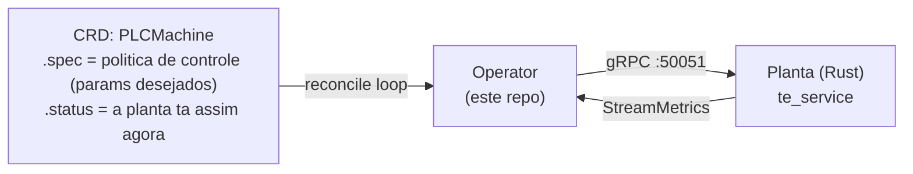

# 01 — Visao geral

## O que e esse repo?

Esse e o **operator Kubernetes** que faz a ponte entre o cluster K8s e a planta TEP (Tennessee Eastman Process). O nome `cluster-api-provider-plc` vem da analogia com os providers do Cluster API — assim como o CAPA provisiona maquinas na AWS, esse provider "provisiona" e supervisiona controladores numa planta industrial via gRPC.

Na pratica: os controladores ja existem na planta (criados no codigo Rust). Voce escreve um YAML declarando a **politica de controle** — com quais parametros esses controladores devem operar. O operator observa a planta via gRPC streaming e, se os parametros divergirem do desejado (ou se aparecer alarme, disturbio, shutdown), ele ajusta. Nao cria nem remove controladores — so reconfigura.

## Onde esse repo se encaixa

O lab tem 4 repositorios:

```
spec-tennessee-eastman       ← issues, specs, decisoes de arquitetura
fork-tennesseeEastman        ← a planta (Rust) + gRPC server
cluster-api-provider-plc     ← ESTE REPO: o operator K8s (Go)
lab-k8s-supervisor           ← infra do cluster (Kind, manifests de deploy)
```

O fluxo e:



## Tecnologia

- **Go 1.25+** com **Kubebuilder 4.12** (controller-runtime v0.23)
- API group: `infrastructure.greenlabs.io/v1alpha1`
- CRD unica: `PLCMachine`
- Comunicacao com a planta: **gRPC** (proto definido no repo `fork-tennesseeEastman`)

## O que ja esta pronto

| O que                        | Status         |
|------------------------------|----------------|
| Scaffold do Kubebuilder      | Completo       |
| CRD PLCMachine (types)       | Desenhada      |
| Reconciler                   | Stub (vazio)   |
| RBAC, Kustomize, Deployment  | Auto-gerado    |
| Dockerfile do operator       | Pronto         |
| Testes unitarios             | Template       |
| Testes E2E                   | Template       |
| CI (lint, test, e2e)         | Scaffolded     |

## Proximo passo

Implementar o reconciler (issue #38) — o coracao do operator que conecta via gRPC na planta e faz a reconciliacao spec vs status.
